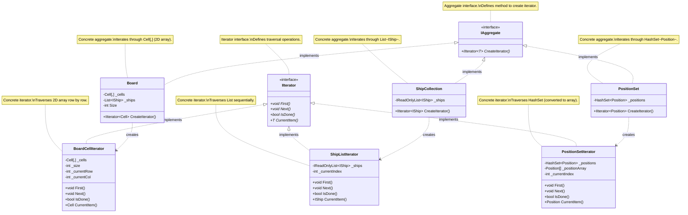

# UML Class Diagram - Iterator Pattern Implementation

## Iterator Pattern Structure



## Pattern Explanation

### Structure Components

1. **IAggregate<T> (Aggregate Interface)**
   - Defines the interface for creating an iterator
   - Has one method: `CreateIterator()` that returns an `IIterator<T>`
   - Implemented by concrete aggregates

2. **IIterator<T> (Iterator Interface)**
   - Defines the interface for accessing and traversing elements
   - Methods:
     - `First()` - Resets iterator to first element
     - `Next()` - Advances to next element
     - `IsDone()` - Checks if traversal is complete
     - `CurrentItem()` - Returns current element

3. **Concrete Aggregates (3 classes)**
   - **Board** - Iterates through `Cell[,]` (2D array)
   - **ShipCollection** - Iterates through `List<IShip>` (List)
   - **PositionSet** - Iterates through `HashSet<Position>` (HashSet)

4. **Concrete Iterators (3 classes)**
   - **BoardCellIterator** - Traverses 2D array row by row
   - **ShipListIterator** - Traverses List sequentially
   - **PositionSetIterator** - Traverses HashSet (converted to array for iteration)

### How It Works

1. **Aggregate Creates Iterator**: Each concrete aggregate implements `CreateIterator()` which returns a new concrete iterator instance:
   ```csharp
   public IIterator<Cell> CreateIterator()
   {
       return new BoardCellIterator(_cells, Size);
   }
   ```

2. **Iterator Traverses Elements**: The iterator provides a uniform interface for traversing different data structures:
   ```csharp
   var iterator = board.CreateIterator();
   iterator.First();
   while (!iterator.IsDone())
   {
       var cell = iterator.CurrentItem();
       // Process cell...
       iterator.Next();
   }
   ```

3. **Different Data Structures**: Each iterator handles a different underlying data structure:
   - `BoardCellIterator` - 2D array (`Cell[,]`)
   - `ShipListIterator` - List (`List<IShip>`)
   - `PositionSetIterator` - HashSet (`HashSet<Position>`)

### Usage Examples

#### Example 1: Iterating Board Cells
```csharp
Board board = new Board(10);
IIterator<Cell> iterator = board.CreateIterator();

iterator.First();
while (!iterator.IsDone())
{
    Cell cell = iterator.CurrentItem();
    Console.WriteLine($"Cell at {cell.Pos}: {cell.Status}");
    iterator.Next();
}
```

#### Example 2: Iterating Ships
```csharp
ShipCollection shipCollection = new ShipCollection(board.Ships);
IIterator<IShip> iterator = shipCollection.CreateIterator();

iterator.First();
while (!iterator.IsDone())
{
    IShip ship = iterator.CurrentItem();
    Console.WriteLine($"Ship: {ship.Name}, Length: {ship.Length}");
    iterator.Next();
}
```

#### Example 3: Iterating Positions
```csharp
HashSet<Position> hitPositions = new HashSet<Position> { /* ... */ };
PositionSet positionSet = new PositionSet(hitPositions);
IIterator<Position> iterator = positionSet.CreateIterator();

iterator.First();
while (!iterator.IsDone())
{
    Position pos = iterator.CurrentItem();
    Console.WriteLine($"Hit at: {pos}");
    iterator.Next();
}
```

### Benefits

- **Uniform Interface**: Same interface for traversing different data structures
- **Separation of Concerns**: Aggregate manages data, Iterator manages traversal
- **Multiple Iterators**: Can have different iterators for same aggregate (e.g., forward, backward, filtered)
- **Encapsulation**: Hides internal representation of data structure
- **Polymorphism**: Client code works with `IIterator<T>` interface, not concrete implementations

### Requirements Met

✅ **Iterate through different data structures**: 
   - `Cell[,]` (2D array) - BoardCellIterator
   - `List<IShip>` (List) - ShipListIterator
   - `HashSet<Position>` (HashSet) - PositionSetIterator

✅ **At least 3 classes**: 
   - BoardCellIterator
   - ShipListIterator
   - PositionSetIterator

✅ **Follows GoF Iterator pattern structure**:
   - IAggregate interface
   - IIterator interface
   - Concrete aggregates (3)
   - Concrete iterators (3)

