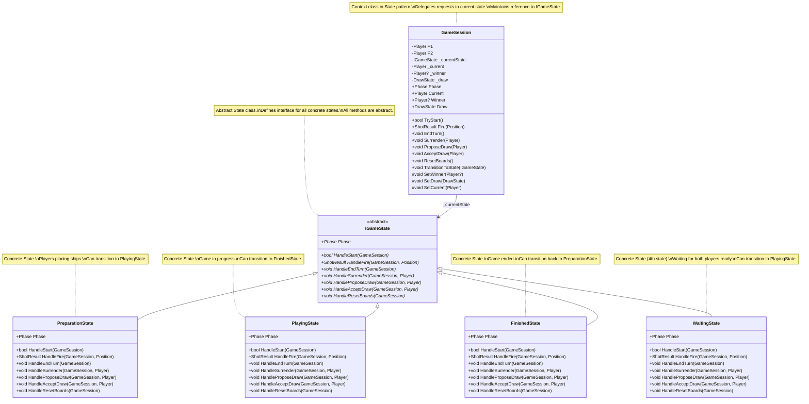
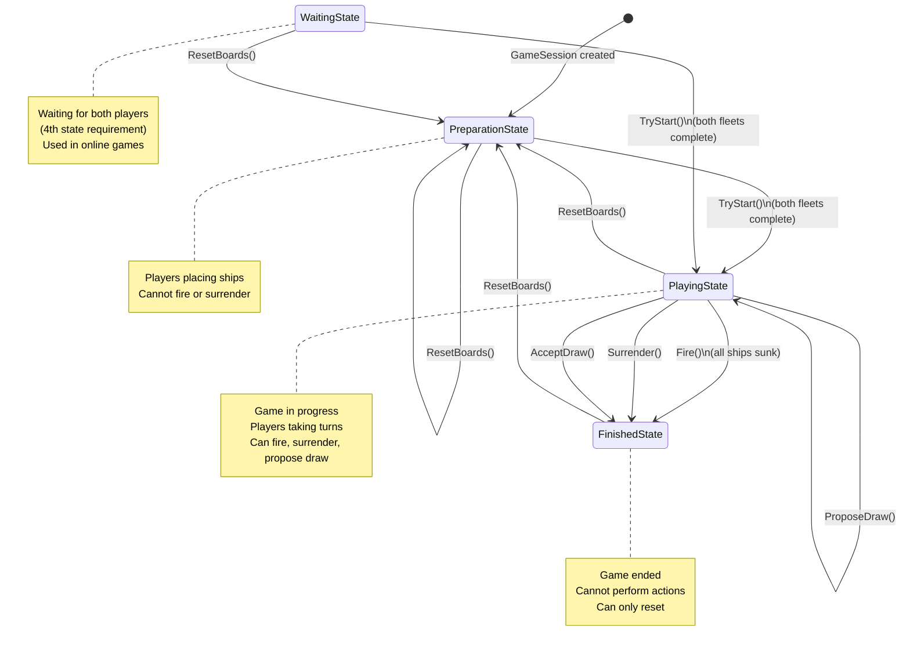

# UML Class Diagram - State Pattern Implementation

## State Pattern Structure

## State Transition Diagram

## Pattern Explanation

### Structure Components

1. **Context (GameSession)**
   - Maintains a reference to a `IGameState` object that defines the current state
   - Delegates state-specific requests to the current state object
   - Provides methods for state transitions (`TransitionToState`)
   - Provides internal methods for states to modify context (`SetWinner`, `SetDraw`, `SetCurrent`)

2. **State (IGameState)**
   - Defines an interface for encapsulating the behavior associated with a particular state
   - All concrete states implement this abstract class
   - Each method represents a request that can be made in different states

3. **Concrete States (PreparationState, PlayingState, FinishedState, WaitingState)**
   - Each concrete state implements behavior associated with a state of the Context
   - Each state handles requests differently based on the game phase
   - States can transition to other states by calling `context.TransitionToState(newState)`

### How It Works

1. **Request Delegation**: When `GameSession` receives a request (e.g., `TryStart()`, `Fire()`), it delegates the request to its current state object by calling the corresponding method on `_currentState`.

2. **State-Specific Behavior**: Each concrete state implements the methods differently:
   - `PreparationState`: Only allows `TryStart()` if fleets are complete; blocks all other actions
   - `PlayingState`: Allows `Fire()`, `EndTurn()`, `Surrender()`, `ProposeDraw()`, `AcceptDraw()`
   - `FinishedState`: Blocks all actions except `ResetBoards()`
   - `WaitingState`: Similar to `PreparationState` but used for online game synchronization

3. **State Transitions**: States transition by calling `context.TransitionToState(newState)`, which:
   - Updates `_currentState` to the new state
   - Notifies observers if the phase changed (Observer pattern integration)

4. **Backward Compatibility**: The `Phase` property returns `_currentState.Phase`, maintaining compatibility with existing code that checks `Session.Phase == Phase.Playing`.

### Benefits

- **Eliminates conditional logic**: No more `if (Phase == Phase.Playing)` checks scattered throughout the code
- **Open/Closed Principle**: Easy to add new states without modifying existing code
- **Single Responsibility**: Each state class handles behavior for one phase
- **Clear state transitions**: State transitions are explicit and centralized
- **Type safety**: Compiler ensures all states implement all required methods

### Difference from Strategy Pattern

- **State Pattern**: Behavior changes based on the object's internal state. States know about and can transition to other states. The context's behavior changes as its state changes.

- **Strategy Pattern**: Behavior is selected at runtime from a family of algorithms. Strategies are independent and don't know about each other. The context uses a strategy to perform an operation, but the strategy doesn't change the context's state.

In this implementation:
- **State Pattern** manages game phases (Preparation → Playing → Finished)
- **Strategy Pattern** manages attack strategies (SingleShotStrategy vs Salvo3x3Strategy)

