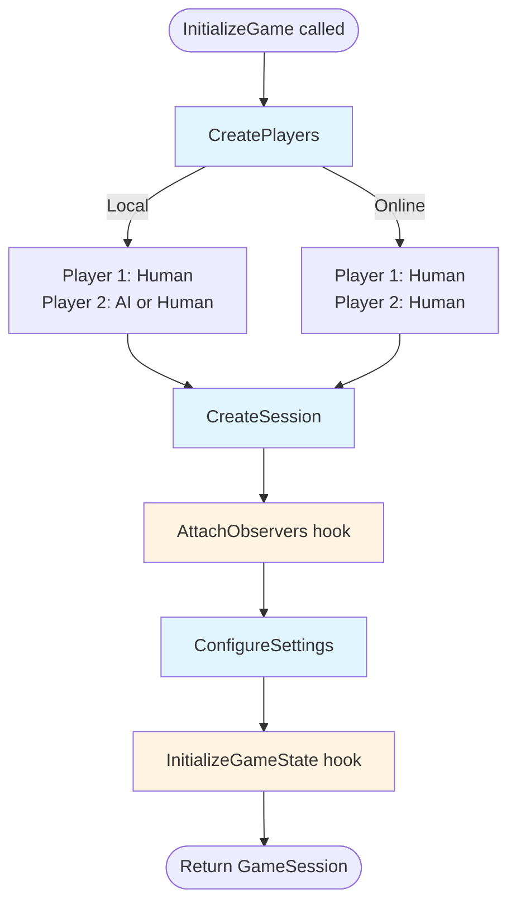

# UML Class Diagram - Template Method Pattern Implementation

## Template Method Pattern Structure

```mermaid
classDiagram
    class AbstractGameInitializer {
        <<abstract>>
        +GameSession InitializeGame(int, ShipType, ShootingMode)
        #(Player, Player) CreatePlayers(int)*
        #GameSession CreateSession(Player, Player)*
        #void ConfigureSettings(GameSession, ShipType, ShootingMode)*
        #void AttachObservers(GameSession)
        #void InitializeGameState(GameSession)
    }

    class LocalGameInitializer {
        -bool _enemyIsAi
        -ShipSkin _shipSkin
        +LocalGameInitializer(bool, ShipSkin)
        #(Player, Player) CreatePlayers(int)
        #GameSession CreateSession(Player, Player)
        #void ConfigureSettings(GameSession, ShipType, ShootingMode)
        #void AttachObservers(GameSession)
        #void InitializeGameState(GameSession)
    }

    class OnlineGameInitializer {
        +OnlineGameInitializer()
        #(Player, Player) CreatePlayers(int)
        #GameSession CreateSession(Player, Player)
        #void ConfigureSettings(GameSession, ShipType, ShootingMode)
        #void AttachObservers(GameSession)
        #void InitializeGameState(GameSession)
    }

    class GameService {
        -IFleetPlacer _fleetPlacer
        +void NewLocalSession(int, bool, ShipType, ShipSkin)
    }

    class OnlineGameSession {
        -string GameId
        -string Player1ConnectionId
        +OnlineGameSession(string, string, int, ShootingMode, ShipType)
    }

    AbstractGameInitializer <|-- LocalGameInitializer : inherits
    AbstractGameInitializer <|-- OnlineGameInitializer : inherits
    GameService --> LocalGameInitializer : uses
    OnlineGameSession --> OnlineGameInitializer : uses

    note for AbstractGameInitializer "Abstract class defining template method.\nInitializeGame() is not virtual (cannot be overridden).\nDefines algorithm structure with primitive operations\nand hook operations."
    note for LocalGameInitializer "Concrete class (sealed).\nImplements local game initialization.\nCreates AI or Human opponent.\nAttaches observers."
    note for OnlineGameInitializer "Concrete class (sealed).\nImplements online game initialization.\nCreates two Human players.\nAttaches observers."
    note for GameService "Service that uses Template Method pattern.\nCalls LocalGameInitializer.InitializeGame()."
    note for OnlineGameSession "Session class that uses Template Method pattern.\nCalls OnlineGameInitializer.InitializeGame()."
```



## Template Method Algorithm Flow



**Legend:**
- Blue boxes: Primitive operations (must be implemented)
- Orange boxes: Hook operations (optional, can be overridden)

## Pattern Explanation

### Structure Components

1. **AbstractGameInitializer (Abstract Class)**
   - Defines the template method `InitializeGame()` which is **not virtual** and cannot be overridden
   - The template method defines the algorithm structure:
     1. Create players (primitive operation)
     2. Create session (primitive operation)
     3. Attach observers (hook operation)
     4. Configure settings (primitive operation)
     5. Initialize game state (hook operation)
   - Contains **primitive operations** (abstract methods) that must be implemented by subclasses
   - Contains **hook operations** (virtual methods) that can be overridden but have default implementations

2. **LocalGameInitializer (Concrete Class - Sealed)**
   - Implements all primitive operations for local game initialization
   - Creates Human player and AI or Human opponent (based on `_enemyIsAi`)
   - Overrides `AttachObservers()` to attach game observers
   - Uses Singleton pattern to get/create GameSession

3. **OnlineGameInitializer (Concrete Class - Sealed)**
   - Implements all primitive operations for online game initialization
   - Creates two Human players (both are human in online games)
   - Overrides `AttachObservers()` to attach game observers
   - Uses Singleton pattern to get/create GameSession

### Template Method Code Structure

```csharp
public GameSession InitializeGame(int boardSize, ShipType shipType, ShootingMode shootingMode = ShootingMode.Single)
{
    // Step 1: Create players (primitive operation - varies by game type)
    var (p1, p2) = CreatePlayers(boardSize);

    // Step 2: Create session (primitive operation)
    var session = CreateSession(p1, p2);

    // Step 3: Attach observers (hook operation - optional, has default)
    AttachObservers(session);

    // Step 4: Configure game settings (primitive operation - varies by game type)
    ConfigureSettings(session, shipType, shootingMode);

    // Step 5: Initialize game state (hook operation - optional, has default)
    InitializeGameState(session);

    return session;
}
```

### Primitive Operations (Abstract Methods)

These **must** be implemented by concrete classes:

1. `CreatePlayers(int boardSize)` - Creates the two players for the game
   - **LocalGameInitializer**: Creates Human + AI or Human
   - **OnlineGameInitializer**: Creates Human + Human

2. `CreateSession(Player p1, Player p2)` - Creates the game session
   - Both use `GameSession.GetInstance(p1, p2)` (Singleton pattern)

3. `ConfigureSettings(GameSession session, ShipType shipType, ShootingMode shootingMode)` - Configures game settings
   - Both are placeholders (settings configured externally)

### Hook Operations (Virtual Methods)

These **can** be overridden but have default implementations:

1. `AttachObservers(GameSession session)` - Attaches observers to the session
   - **Default**: Does nothing
   - **LocalGameInitializer**: Attaches GameStateObserver, TurnChangeObserver, GameEndObserver
   - **OnlineGameInitializer**: Attaches GameStateObserver, TurnChangeObserver, GameEndObserver

2. `InitializeGameState(GameSession session)` - Initializes additional game state
   - **Default**: Does nothing
   - Both implementations: No additional initialization needed

### Usage Examples

#### Example 1: Local Game Initialization
```csharp
// In GameService.NewLocalSession()
var initializer = new LocalGameInitializer(enemyIsAi: true, shipSkin: ShipSkin.Default);
Session = initializer.InitializeGame(size, shipType, ShootingMode);
```

**What happens:**
1. `CreatePlayers()` → Creates Human + AI
2. `CreateSession()` → Gets Singleton GameSession
3. `AttachObservers()` → Attaches 3 observers
4. `ConfigureSettings()` → Placeholder (settings set externally)
5. `InitializeGameState()` → No additional initialization

#### Example 2: Online Game Initialization
```csharp
// In OnlineGameSession constructor
var initializer = new OnlineGameInitializer();
GameSession = initializer.InitializeGame(boardSize, shipType, shootingMode);
```

**What happens:**
1. `CreatePlayers()` → Creates Human + Human
2. `CreateSession()` → Gets Singleton GameSession
3. `AttachObservers()` → Attaches 3 observers
4. `ConfigureSettings()` → Placeholder (settings set externally)
5. `InitializeGameState()` → No additional initialization

### Benefits

- **Code Reuse**: Common algorithm structure is defined once in the abstract class
- **Flexibility**: Subclasses can vary specific steps while keeping the overall structure
- **Control Flow**: Template method controls the algorithm flow, subclasses implement details
- **Open/Closed Principle**: Easy to add new initialization types without modifying existing code
- **Consistency**: All game initializations follow the same structure
- **Backward Compatibility**: Existing code continues to work the same way

### Difference from Strategy Pattern

- **Template Method**: Uses **inheritance** to vary parts of an algorithm. The algorithm structure is fixed, but specific steps can be customized. The template method defines the skeleton of the algorithm.

- **Strategy Pattern**: Uses **delegation** to vary the entire algorithm. Strategies are independent and can be swapped at runtime. The context delegates to a strategy object.

In this implementation:
- **Template Method** manages the initialization algorithm structure (create players → create session → attach observers → configure → initialize)
- **Strategy Pattern** manages attack strategies (SingleShotStrategy vs Salvo3x3Strategy)

### Requirements Met

✅ **At least 2 sealed concrete classes**: 
   - `LocalGameInitializer` (sealed)
   - `OnlineGameInitializer` (sealed)

✅ **Template method is not virtual**: 
   - `InitializeGame()` is not marked as virtual or abstract, so it cannot be overridden

✅ **Primitive operations are abstract**: 
   - `CreatePlayers()`, `CreateSession()`, `ConfigureSettings()` are abstract

✅ **Hook operations are virtual**: 
   - `AttachObservers()`, `InitializeGameState()` are virtual with default implementations

✅ **Backward compatibility**: 
   - All existing code continues to work the same way
   - `GameService.NewLocalSession()` and `OnlineGameSession` constructor work identically
